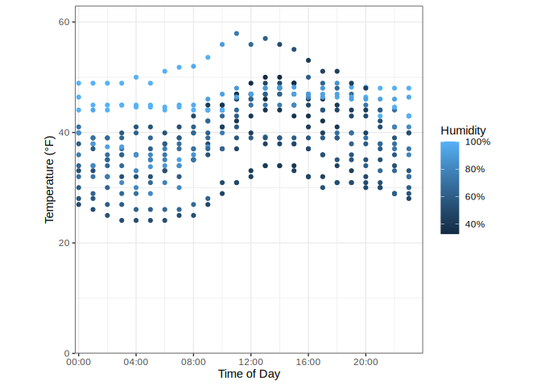

P8105 Homework 1
================
Joshua Carpenter
2023-09-22

``` r
library(moderndive)
library(ggplot2)
library(scales)
library(tidyverse)
```

## Question 1

The `early_january_weather` (358 rows × 15 columns) dataset contains
hourly meterological data for LGA, JFK and EWR for the month of January
2013. It has a structure of one row per timepoint per weather station
(`origin`). We will be focused on the temperature (`temp`) in fahrenheit
and relative humidity (`humid`) against time. The time of each
measurement is recorded in the numeric variables `year`, `month`, `day`,
and `hour`. The overall mean temperature in the dataset is 39.6℉ and the
mean humidity is 65.5%.

Below is a plot of temperature against time of the day (midnight to
midnight). As we might expect, the temperature tends to reach a minimum
in the early morning, increase during the day, and begin to drop off in
the evening. The temperatures have a fairly narrow spread consistent
with what we might expect in January, with a few particularly warm or
cold days that we can clearly follow. It would also appear that higher
temperatures might be associated with higher humidities.

``` r
ggplot(data = early_january_weather, 
       mapping = aes(x = hms::hms(hours = hour), y = temp, color = humid)) +
  geom_point() +
  theme_bw() +
  theme(aspect.ratio = 1) +
  coord_cartesian(
    ylim = c(0, max(early_january_weather$temp) + 5), 
    xlim = c(hms::hms(minutes = -15), hms::hms(hours = 23, minutes = 59)), 
    expand = FALSE) +
  labs(x = "Time of Day", 
       y = "Temperature (\u00B0F)", 
       color = "Humidity") +
  scale_x_time(labels = label_time(format = "%H:%M")) +
  scale_color_continuous(labels = ~paste(.x, "%", sep = ""))
```

<!-- -->

``` r
ggsave(filename = "early_jan_temp.jpg")
```

    ## Saving 7 x 5 in image

## Question 2

In this code chunk, we create a dataframe for the purposes of
demonstrating the differences between variable types and what happens
when you coerce one type into another. As we see from the warnings, the
mean function produces NA for any vector that is not numeric or logical.

``` r
var_types_df <- tibble(
  norm = rnorm(10),
  gt0 = norm > 0,
  char = c(letters[1:8], "1", "34"),
  fact = factor(c("High", "Medium", "Medium", "Low", "High", "Low", 
                  "Low", "Low", "High", "Medium"), 
                c("Low", "Medium", "High"))
)
var_types_df |>
  summarise_all(mean)
```

    ## Warning: There were 2 warnings in `summarise()`.
    ## The first warning was:
    ## ℹ In argument: `char = (function (x, ...) ...`.
    ## Caused by warning in `mean.default()`:
    ## ! argument is not numeric or logical: returning NA
    ## ℹ Run `dplyr::last_dplyr_warnings()` to see the 1 remaining warning.

    ## # A tibble: 1 × 4
    ##     norm   gt0  char  fact
    ##    <dbl> <dbl> <dbl> <dbl>
    ## 1 -0.143   0.6    NA    NA

If we coerce the character and factor variables into numeric, we could
take the mean, but it might not be very meaningful.

``` r
var_types_df |>
  transmute(char_coer = as.numeric(char), fact_coer = as.numeric(fact)) |>
  summarise_all(mean, na.rm=T)
```
